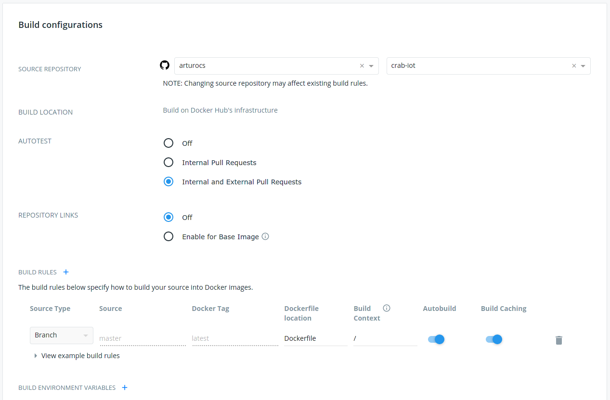

## Justificación de la imagen base elegida


Inicialmente había considerado usar las imágenes oficiales de Rust, pero descargar las tres variantes que ofrecen, me di cuenta de que ninguna de ellas era precisamente pequeña. 

```
[arturo@arturo-ms7845 crab-iot]$ docker images
REPOSITORY                 TAG                 IMAGE ID            CREATED             SIZE
rust                       alpine              aeced591196c        3 days ago          642MB
rust                       1-slim-buster       e2cf0322c151        3 days ago          681MB
rust                       latest              a4b51fc0e875        3 days ago          1.29GB
```

Así que empecé a comparar tamaños de distintas imágenes populares.

```
[arturo@arturo-ms7845 crab-iot]$ docker images
REPOSITORY                 TAG                 IMAGE ID            CREATED             SIZE
debian                   latest              ef05c61d5112        5 days ago          114MB
fedora                   latest              b3048463dcef        11 days ago         175MB
ubuntu                   latest              d70eaf7277ea        4 weeks ago         72.9MB
ubuntu                   18.04               56def654ec22        8 weeks ago         63.2MB
alpine                   latest              d6e46aa2470d        4 weeks ago         5.57MB
busybox                  latest              f0b02e9d092d        5 weeks ago         1.23MB
centos                   latest              0d120b6ccaa8        3 months ago        215MB
```

En un principio decidí utilizar la imagen de Busybox, pero no tardé en darme cuenta de que no era viable, así que pasé a considerar la siguiente imagen mas pequeña, Alpine. El problema es que ya sabía cuanto iba a ocupar dicha imagen, pues entre las imágenes oficiales de Rust, ya hay imágenes de Alpine. Así que tratando de explorar otras posibilidades finalmente me decanté por una imagen de la Ubuntu 18.04 LTS, cuya imagen base se sitúa en unos razonables 63MB. De esta forma obtendría una imagen de tamaño pequeño-mediano, con gran soporte comunitario y cuyas herramientas son sobradamente conocidas.


Tras generar la imagen podemos ver como su tamaño ha resultado ser inferior al de la imagen oficial de rust slim.

```
REPOSITORY          TAG                 IMAGE ID            CREATED             SIZE
arturocs/crab-iot   latest              23955a504a62        5 seconds ago       678MB
```


A continuación vamos a comparar el numero de capas de la imagen generada con el de la imagen base usando la herramienta skopeo:

Capas de la imagen base:

```json
$ skopeo inspect docker-daemon:ubuntu:18.04 

{
  "Name": "docker.io/library/ubuntu",
  "Digest": "sha256:9851e44b279aee850d517793a829a9660e15bdf5c9899a37d043c9d289a0fa98",
  "RepoTags": [],
  "Created": "2020-09-25T22:33:52.495173292Z",
  "DockerVersion": "18.09.7",
  "Labels": null,
  "Architecture": "amd64",
  "Os": "linux",
  "Layers": [
    "sha256:80580270666742c625aecc56607a806ba343a66a8f5a7fd708e6c4e4c07a3e9b",
    "sha256:3fd9df55318470e88a15f423a7d2b532856eb2b481236504bf08669013875de1",
    "sha256:7a694df0ad6cc5789a937ccd727ac1cda528a1993387bf7cd4f3c375994c54b6"
  ],
  "Env": [
    "PATH=/usr/local/sbin:/usr/local/bin:/usr/sbin:/usr/bin:/sbin:/bin"
  ]
}

```


Capas de crab-iot:

```json
$ skopeo inspect docker-daemon:arturocs/crab-iot:latest

{
  "Name": "docker.io/arturocs/crab-iot",
  "Digest": "sha256:5dcd6d9b7ac42c066e75ed476ddb1e7e104dd246370109ec922e154e214ccb90",
  "RepoTags": [],
  "Created": "2020-12-05T04:20:33.230183192Z",
  "DockerVersion": "19.03.13-ce",
  "Labels": null,
  "Architecture": "amd64",
  "Os": "linux",
  "Layers": [
    "sha256:80580270666742c625aecc56607a806ba343a66a8f5a7fd708e6c4e4c07a3e9b",
    "sha256:3fd9df55318470e88a15f423a7d2b532856eb2b481236504bf08669013875de1",
    "sha256:7a694df0ad6cc5789a937ccd727ac1cda528a1993387bf7cd4f3c375994c54b6",
    "sha256:b3acbb9e71919aac2e22ba11ca13a7a727e802a0585aeac342a9fc8a94987c0c",
    "sha256:137da73bd2d3c37575125df145df8aedcdbba2c2c40addd1016e626ce0cac3be"
  ],
  "Env": [
    "PATH=/usr/local/cargo/bin:/usr/local/sbin:/usr/local/bin:/usr/sbin:/usr/bin:/sbin:/bin",
    "RUSTUP_HOME=/usr/local/rustup",
    "CARGO_HOME=/usr/local/cargo",
    "RUST_VERSION=1.48.0"
  ]
}

```

Podemos comprobar que añadir las herramientas de compilación de Rust ha generado dos capas extra. 


Para tratar de optimizar la imagen vamos a ver como se distribuye el peso de la imagen usando docker history:


Imagen base de Ubuntu 18.04

```shell
$ docker history ubuntu:18.04
IMAGE               CREATED             CREATED BY                                      SIZE                COMMENT
56def654ec22        2 months ago        /bin/sh -c #(nop)  CMD ["/bin/bash"]            0B                  
<missing>           2 months ago        /bin/sh -c mkdir -p /run/systemd && echo 'do…   7B                  
<missing>           2 months ago        /bin/sh -c [ -z "$(apt-get indextargets)" ]     0B                  
<missing>           2 months ago        /bin/sh -c set -xe   && echo '#!/bin/sh' > /…   745B                
<missing>           2 months ago        /bin/sh -c #(nop) ADD file:4974bb5483c392fb5…   63.2MB 
```


Imagen de crab-iot

```shell
$ docker history arturocs/crab-iot:latest                         
IMAGE               CREATED             CREATED BY                                      SIZE                COMMENT
0966c81b1ccb        6 minutes ago       /bin/sh -c #(nop)  CMD ["make" "test"]          0B                  
396cfecba640        6 minutes ago       /bin/sh -c #(nop)  USER crabiot                 0B                  
4a344d357962        6 minutes ago       /bin/sh -c #(nop) WORKDIR /app/test             0B                  
73c086faae59        6 minutes ago       /bin/sh -c apt-get update;     apt-get insta…   616MB               
975e7d6b82c8        10 days ago         /bin/sh -c #(nop)  ENV RUSTUP_HOME=/usr/loca…   0B                  
56def654ec22        2 months ago        /bin/sh -c #(nop)  CMD ["/bin/bash"]            0B                  
<missing>           2 months ago        /bin/sh -c mkdir -p /run/systemd && echo 'do…   7B                  
<missing>           2 months ago        /bin/sh -c [ -z "$(apt-get indextargets)" ]     0B                  
<missing>           2 months ago        /bin/sh -c set -xe   && echo '#!/bin/sh' > /…   745B                
<missing>           2 months ago        /bin/sh -c #(nop) ADD file:4974bb5483c392fb5…   63.2MB
```


Como vemos todo el peso se concentra en el comando que instala cargo y sus dependencias, herramientas básicas para poder compilar el proyecto. Por lo tanto la única opción para recortar en tamaño es eliminar paquetes que previamente vinieran en la imagen base. Sin embargo Ubuntu advierte que eliminar alguno de estos paquetes puede resultar en un sistema roto, es por eso que finalmente he decidido dejar la imagen tal y como está en este punto.


## Actualización automática

Nos registramos en docker hub y enlazamos la cuenta de github:


Iniciamos sesión en docker y subimos la imagen:


Activamos el servicio de actualización automática:



## Registros alternativos

Para usar Github Container Registry he seguido las [instrucciones oficiales](https://docs.github.com/en/free-pro-team@latest/packages/managing-container-images-with-github-container-registry/pushing-and-pulling-docker-images).

Primero hay que activar la funcionalidad, ya que aun está en beta.


También hay que generar un token


Una vez tenemos el token podemos usarlo para iniciar sesión con:

```
sudo docker login ghcr.io -u arturocs
```

Con la sesión ya iniciada en docker podemos hacer push de la imagen a Github Container Registry


Cuando acabe de subirse la imagen podemos comprobar que se ha generado un nuevo paquete:

